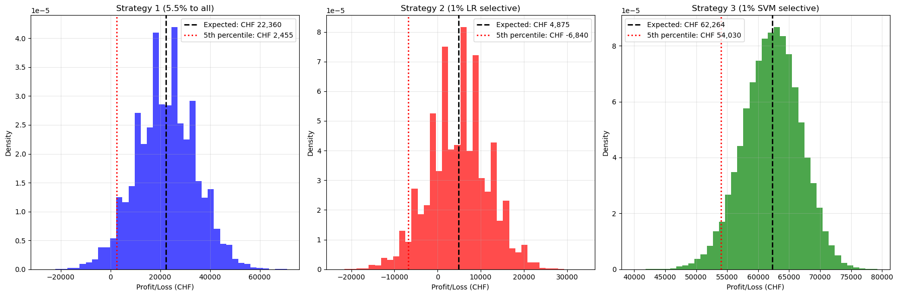

# Project 2: Credit Analytics (Consumer Loan Risk)

## Summary
Build probabilistic risk scores for consumer loans from simulated borrower features and compare logistic regression with kernel SVM probability estimates. Use the learned scores to evaluate lending strategies.

## What this notebook covers
- Simulation of borrower features and descriptive statistics
- Two regimes with default probabilities defined through a logistic link
- Model training and evaluation
  - Logistic regression with cross-entropy loss
  - Kernel SVM with probability calibration (Platt scaling)
  - Impact of feature scaling choices
- Discrimination assessment on the test set
  - ROC curves and AUC comparison
## Lending strategies (simulation)
We evaluate three lending strategies by simulating many market scenarios and comparing the resulting **P&L distributions** (expected P&L and 95% VaR). The key idea is to trade off higher volume (more loans granted) against lower default risk (stricter selection).

### Strategy (i): Lend to everyone (high-rate blanket policy)
All applicants are approved. Since the lender accepts the entire pool (including high-risk borrowers), the interest rate is set higher to compensate for expected losses. This strategy maximizes volume but typically exhibits higher downside risk in stressed scenarios.

### Strategy (ii): Risk-based selection using Logistic Regression
Applicants are approved only if their predicted default probability from the logistic regression model is below a chosen threshold. The threshold is tuned to balance profitability and risk (more conservative thresholds reduce defaults but also reduce volume). This produces a more controlled risk profile than the blanket policy.

### Strategy (iii): Risk-based selection using SVM + calibrated probabilities
Same decision rule as Strategy (ii), but using probabilities derived from a kernel SVM after calibration (Platt scaling). Because the underlying classifier is different, the ranking of borrower risk and the resulting acceptance set can differ from logistic regression, leading to different P&L and tail-risk outcomes.

### Metrics
For each strategy, we estimate:

- **Expected P&L**: the average profit (or loss) across many simulated market scenarios. It summarizes the strategy’s expected profitability.

- **95% Value-at-Risk (VaR)**: a downside risk measure defined as the 5th percentile of the P&L distribution. In other words, in 95% of scenarios the P&L is above this value, while in the worst 5% of scenarios losses can be larger (more negative) than the VaR.

## P&L distributions by strategy

